# SmartAudit

**Privileged Access Management (PAM) platform with AI-powered session analysis.**

SmartAudit monitors SSH, RDP, and VNC sessions in real time, captures full session recordings with keystroke logs, runs 235+ regex patterns aligned to the MITRE ATT&CK framework, and performs post-session LLM analysis — all through two cross-platform Electron desktop apps.

---

## Architecture



**Data flow summary:**
1. Client connects to a target server through `guacamole-lite` -> `guacd` -> target
2. Backend intercepts every WebSocket message to extract keystrokes and relay screen data
3. Keystrokes feed into the Risk Detection Service for real-time pattern matching
4. Screen data is pushed to auditors via Socket.IO for live monitoring
5. On session end: keystrokes are saved, `.guac` recording is uploaded to Supabase Storage, and LLM analysis runs
6. Auditors can review recorded sessions via `SessionPlayback` using signed `.guac` URLs

---

## Features

- **Remote Desktop Proxy** -- SSH, RDP, VNC through Apache Guacamole
- **Session Recording** -- native `.guac` files (1-5 MB/hour) with full protocol fidelity
- **Keystroke Capture** -- timestamped keystroke logging with character extraction
- **Live Monitoring** -- auditors watch sessions in real time via Guacamole protocol relay
- **Real-Time Risk Detection** -- 235 regex patterns, 13 attack sequences, anti-evasion normalization
- **AI Analysis** -- two-tier LLM analysis (light for low-risk, full for high-risk sessions)
- **MITRE ATT&CK Mapping** -- 95 techniques across 11 tactics with behavioral flags
- **Session Playback** -- YouTube-style player with seek
- **User Management** -- 4 hierarchical roles: super_admin, admin, auditor, client
- **Access Control** -- Discord-style groups, per-server and per-group access grants
- **Ban System** -- global or server-specific bans with expiry and freeze (ban + disable + terminate)
- **Audit Logging** -- immutable trail for compliance (SOX, HIPAA, PCI-DSS, ISO 27001)
- **Cross-Platform** -- Electron apps for macOS (dmg), Windows (exe)

---

## Quick Start (Local Development)

### Prerequisites

| Requirement | Version | Purpose |
|---|---|---|
| Node.js | 20+ | Runtime |
| pnpm | 8+ | Package manager |
| Docker | any | guacd + test servers |
| Supabase account | -- | Database + storage |
| OpenRouter API key | -- | AI analysis |

### 1. Install dependencies

```bash
git clone <repository-url>
cd SmartAIAudit
pnpm install
```

### 2. Start guacd and test servers

```bash
# From project root — starts guacd + SSH/VNC/RDP test containers
docker compose -f docker/docker-compose.yml up -d
```

Test servers: SSH on `localhost:2222`, VNC on `localhost:5901`, RDP on `localhost:3389`.
Credentials: `testuser` / `testpass`.

### 3. Set up Supabase database

Create a Supabase project at [supabase.com](https://supabase.com), then run the consolidated migrations in order in the **SQL Editor**:

```
supabase/reduced_migrations/001_extensions_and_utilities.sql
supabase/reduced_migrations/002_core_tables.sql
supabase/reduced_migrations/003_sessions_and_risk.sql
supabase/reduced_migrations/004_access_control.sql
supabase/reduced_migrations/005_audit_and_settings.sql
```

Then create a **private** storage bucket named `session-recordings` and folder named `guac` via the Dashboard, and run:

```
supabase/reduced_migrations/006_storage_policies.sql
supabase/reduced_migrations/007_storage_monitoring.sql
supabase/reduced_migrations/008_views_and_comments.sql
```

### 4. Configure environment

```bash
cp apps/backend/.env.example apps/backend/.env
# Edit apps/backend/.env with your Supabase and OpenRouter credentials

cp apps/client-desktop/.env.example apps/client-desktop/.env
cp apps/auditor-desktop/.env.example apps/auditor-desktop/.env
# Edit both with your Supabase URL and publishable key
```

Backend `.env` requires:

```env
SUPABASE_PROJECT_URL=https://your-project.supabase.co
SUPABASE_PUBLISHABLE_API_KEY=sb_publishable_...
SUPABASE_SECRET_KEY=sb_secret_...
OPENROUTER_API_KEY=sk-or-v1-...
JWT_SECRET=<at-least-32-chars>        # generate: openssl rand -hex 32
ENCRYPTION_KEY=<at-least-32-chars>    # generate: openssl rand -hex 32
GUACD_HOST=localhost
GUACD_PORT=4822
```

### 5. Run the setup wizard

Start the backend and visit `POST /api/setup/init` (or use the auditor app's first-run wizard) to create the initial super_admin account.

### 6. Start all services

```bash
# Terminal 1 — Backend
pnpm dev:backend

# Terminal 2 — Client app (for connecting to servers)
pnpm dev:client

# Terminal 3 — Auditor app (for monitoring and review)
pnpm dev:auditor
```

---

## Deployment

Four deployment paths are available. See [README_MORE.md](./README_MORE.md#deployment-guides) for full details.

### Option 1: Cloud Supabase + Docker backend

The standard production setup. Supabase runs on their cloud; backend + guacd run in Docker on your server.

```bash
cd docker/deploy
./setup.sh        # interactive wizard — choose "Cloud Supabase"
```

Config file: `docker/deploy/.env`

### Option 2: Self-hosted Supabase + Docker backend

Everything runs on your infrastructure. The setup wizard starts PostgreSQL, PostgREST, GoTrue, and Storage API in Docker alongside the backend.

```bash
cd docker/deploy
./setup.sh        # choose "Self-hosted"
```

Config file: `docker/deploy/.env` (includes `POSTGRES_PASSWORD`)

### Option 3: Fly.io demo deployment

One-command deployment for demos and testing. Backend + guacd run co-located on Fly.io; demo target servers run on a separate private Fly app.

```bash
# Fill in .env at repo root with Supabase + security keys
cp docker/deploy/.env.example .env
# Edit .env

./scripts/deploy-demo.sh
```

Estimated cost: ~$9.72/month (2 always-on Fly machines in Singapore).

### Option 4: Build distributable desktop apps

After deploying a backend (any option above), build the Electron installers:

```bash
# Point apps at your backend
# Edit apps/client-desktop/.env and apps/auditor-desktop/.env:
#   VITE_BACKEND_URL=https://your-backend.example.com
#   VITE_BACKEND_WS_URL=wss://your-backend.example.com

# Build for current platform
pnpm --filter @smartaiaudit/shared build
pnpm --filter @smartaiaudit/client-desktop build && pnpm --filter @smartaiaudit/client-desktop package:mac
pnpm --filter @smartaiaudit/auditor-desktop build && pnpm --filter @smartaiaudit/auditor-desktop package:mac

# Or use the demo build script (swaps .env automatically)
./scripts/build-demo-apps.sh --mac    # or --win, --all
```

Outputs: `apps/client-desktop/release/` and `apps/auditor-desktop/release/` (`.dmg`, `.exe`, `.AppImage`).

---

## Project Structure

```
SmartAIAudit/
├── apps/
│   ├── backend/                  # Node.js API server
│   │   ├── src/
│   │   │   ├── index.ts          # Entry: Express + Socket.IO + guacamole-lite
│   │   │   ├── config/           # env (Zod), guacamole, supabase
│   │   │   ├── services/         # 13 services (see architecture diagram)
│   │   │   ├── routes/           # 11 route modules
│   │   │   ├── middleware/       # auth, CORS, logger, error handler
│   │   │   └── utils/            # Winston logger
│   │   └── rules/                # Externalized JSON risk rules
│   │       ├── patterns.json     # 235 regex patterns (4 severity levels)
│   │       ├── sequences.json    # 13 multi-step attack chains
│   │       └── scoring.json      # Weights, LLM thresholds, model config
│   ├── client-desktop/           # Electron app for end users
│   │   └── src/
│   │       ├── main/             # Electron main process
│   │       ├── preload/          # Context bridge
│   │       └── renderer/         # React UI (connect to servers, see sessions)
│   └── auditor-desktop/          # Electron app for security teams
│       └── src/
│           ├── main/             # Electron main process
│           ├── preload/          # Context bridge
│           └── renderer/         # React UI (live monitor, playback, analytics)
├── packages/
│   └── shared/                   # Shared TypeScript types, constants, utils
├── supabase/
│   ├── migrations/               # 18 original dev migrations (000–017)
│   └── reduced_migrations/       # 8 consolidated migrations (001–008)
├── docker/
│   ├── docker-compose.yml        # Dev: guacd + SSH/VNC/RDP test servers
│   ├── deploy/                   # Production: Dockerfiles, compose, setup wizard
│   └── test-servers/             # Dockerfiles for SSH, VNC, RDP test containers
├── fly/                          # Fly.io deployment configs
├── scripts/                      # deploy-demo.sh, build-demo-apps.sh, seed-demo
└── docs/                         # Extended documentation (40+ files)
```

---

## Technology Stack

| Layer | Technology |
|---|---|
| Desktop apps | Electron 28, React 18, TypeScript, Tailwind CSS, Vite, Zustand |
| Backend | Node.js 20+, Express, Socket.IO (polling), guacamole-lite |
| Database | Supabase (PostgreSQL 15 + Storage + RLS) |
| Remote desktop | Apache guacd, guacamole-common-js |
| AI analysis | OpenRouter API (Claude Sonnet/Haiku, Gemini Pro/Flash) |
| Risk detection | 235 regex patterns, 13 attack sequences, externalized JSON rules |
| Auth | JWT (24h), PBKDF2-SHA512 password hashing, 4-role RBAC |
| Encryption | AES-256-CBC (Guacamole tokens), TLS for all connections |
| Build / package | electron-vite, electron-builder (dmg/exe/AppImage/deb) |
| Infrastructure | Docker, Docker Compose, Fly.io, Supervisord |

---

## API Overview

### REST Endpoints

| Method | Path | Purpose |
|---|---|---|
| `GET` | `/health`, `/ready` | Health checks |
| `POST` | `/api/auth/login` | Login (returns JWT) |
| `GET` | `/api/auth/me` | Current user profile |
| `POST` | `/api/setup/init` | First-run setup wizard |
| `GET` | `/api/sessions` | List sessions (filterable) |
| `GET` | `/api/sessions/:id` | Session detail with analysis |
| `GET` | `/api/sessions/:id/recording-url` | Signed URL for .guac playback |
| `POST` | `/api/sessions/:id/review` | Mark session as reviewed |
| `POST` | `/api/sessions/:id/tags` | Add/remove tags |
| `GET` | `/api/connections/servers` | Available servers for client |
| `POST` | `/api/connections/token` | Generate Guacamole connection token |
| `GET` | `/api/admin/dashboard` | Dashboard statistics |
| `GET/POST` | `/api/admin/servers` | Server CRUD |
| `GET/POST` | `/api/admin/rules/*` | View/reload risk detection rules |
| `GET/POST` | `/api/users` | User management (admin) |
| `GET/POST` | `/api/groups` | Group management |
| `POST` | `/api/bans` | Ban/unban/freeze users |

### Socket.IO Events

| Direction | Event | Payload |
|---|---|---|
| Client -> Server | `watch-session` | `sessionId` |
| Client -> Server | `unwatch-session` | `sessionId` |
| Client -> Server | `terminate-session` | `sessionId` |
| Server -> Client | `guac-data` | `{sessionId, data}` |
| Server -> Client | `session-update` | `{sessionId, status, riskLevel, ...}` |
| Server -> Client | `session-started` | `{sessionId, session}` |
| Server -> Client | `session-ended` | `{sessionId}` |
| Server -> Client | `risk-alert` | `{sessionId, level, pattern, matchedText}` |

---

## User Roles

| Role | Access |
|---|---|
| `super_admin` | Everything — user management, server management, monitoring, settings |
| `admin` | User/server/group CRUD, session monitoring, analytics, ban management |
| `auditor` | Live monitoring, session review, terminate sessions, reports |
| `client` | Connect to assigned servers via the client desktop app only |

---

## Security

- **Authentication** -- custom JWT + PBKDF2-SHA512 (not Supabase Auth)
- **Guacamole tokens** -- AES-256-CBC encrypted connection parameters
- **Database** -- Row Level Security (RLS) on all 15 tables; backend uses secret key
- **Audit trail** -- immutable `audit_log` table with actor, action, resource, IP, timestamp
- **Real-time risk alerts** -- critical/high alerts broadcast to all connected auditors
- **Credential handling** -- server passwords stored in Supabase

---

## Development Commands

```bash
# Start everything in parallel
pnpm dev

# Start individually
pnpm dev:backend      # Backend on :8080
pnpm dev:client       # Client Electron app
pnpm dev:auditor      # Auditor Electron app

# Build
pnpm build            # Build all packages

# Lint and type check
pnpm lint
pnpm typecheck
```

---

## Further Reading

See [README_MORE.md](./README_MORE.md) for deep dives on:

- [Live Streaming Architecture](./README_MORE.md#live-streaming-architecture) -- how screen data flows to auditors, compared to alternative approaches
- [Session Playback](./README_MORE.md#session-playback) -- how `.guac` recording and the YouTube-style player work
- [AI Analysis Pipeline](./README_MORE.md#ai-analysis-pipeline) -- two-tier LLM analysis with MITRE ATT&CK output
- [Risk Detection System](./README_MORE.md#risk-detection-system) -- patterns, sequences, anti-evasion, and how to update rules
- [Deployment Guides](./README_MORE.md#deployment-guides) -- detailed steps for all four deployment options
- [Database Schema](./README_MORE.md#database-schema) -- all 15 tables, relationships, and consolidated migrations

---# Teemplate-SmartAudit

