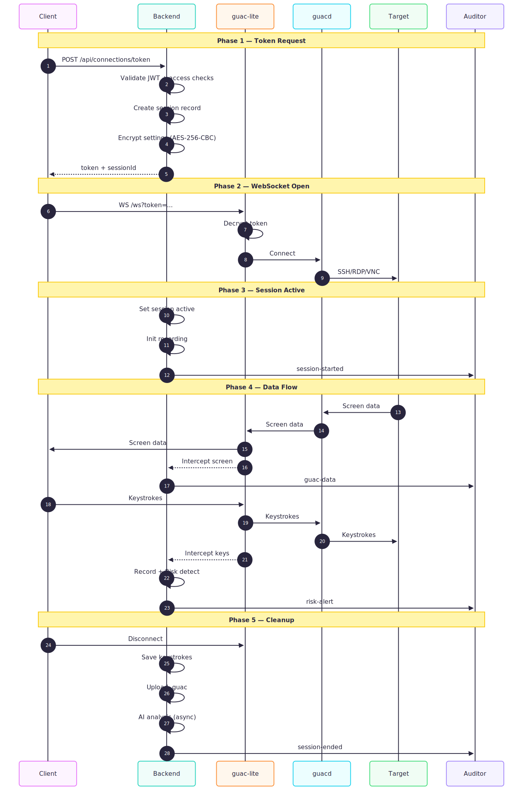

# SmartAudit — Technical Deep Dives

Extended documentation covering architecture internals, streaming, playback, AI analysis, risk detection, deployment, and database schema.

---

## Table of Contents

- [Live Streaming Architecture](#live-streaming-architecture)
- [Session Playback](#session-playback)
- [AI Analysis Pipeline](#ai-analysis-pipeline)
- [Risk Detection System](#risk-detection-system)
- [Deployment Guides](#deployment-guides)
- [Database Schema](#database-schema)
- [Environment Variables Reference](#environment-variables-reference)
- [Background Jobs](#background-jobs)
- [Guacamole Connection Flow](#guacamole-connection-flow)

---

## Live Streaming Architecture

### How it works

When a client connects to a remote server, the auditor app can watch the session in real time. The screen data follows this path:



Key implementation details:

1. **guacamole-lite owns the `/ws` WebSocket path** on the shared HTTP server. It decrypts the AES-256-CBC token and proxies the connection to guacd.

2. **Socket.IO uses HTTP long-polling only** (`transports: ['polling'], allowUpgrades: false`) on the `/socket.io/` path to avoid WebSocket conflicts with guacamole-lite. This is deliberate — Socket.IO carries both high-bandwidth screen data (`guac-data` events relayed to auditors) and low-bandwidth control events (risk alerts, session updates). Polling is sufficient because guacamole-lite already handles the latency-critical client↔server data path over its own WebSocket.

3. **The backend intercepts messages** by monkey-patching `ws.send` on the underlying WebSocket server. Every outgoing Guacamole protocol message is copied and broadcast to watching auditors. Incoming messages containing `.key,` are parsed for keystrokes.

4. **The auditor's LiveStreamViewer** creates a local Guacamole `Client` backed by a **dummy tunnel** (never connects to a real WebSocket). A `Guacamole.Parser` processes the raw protocol strings received via Socket.IO, and feeds parsed instructions into the client's display pipeline.

5. **Late-join protocol**: When an auditor starts watching a session already in progress, the backend sends: (a) the latest screenshot, (b) display layer sizes, (c) cached drawing instructions (up to 2000), and (d) a synthetic `sync` instruction to flush the display.

### Approach comparison

| Approach | How it works | Pros | Cons |
|---|---|---|---|
| **Guac protocol relay (selected)** | Intercept Guacamole protocol messages on the backend and relay to auditors via Socket.IO | Perfect fidelity, no transcoding, low latency, tiny bandwidth (only drawing instructions) | Requires Guacamole parser on the auditor side; Socket.IO polling adds slight overhead vs pure WebSocket |
| WebRTC screen share | Client captures screen and establishes a WebRTC peer connection to auditors | Native browser support, adaptive bitrate | Requires STUN/TURN servers, scales poorly to many viewers, client must actively share (can be bypassed) |
| Server-side VNC/RDP capture | Run a separate VNC/RDP client on the backend that captures the target screen | Client is not involved in streaming | Doubles the connection to the target (one for client, one for backend), higher server resource usage |
| Screenshot polling | Client periodically takes screenshots and uploads them | Simple to implement, works with any protocol | High latency (seconds), bandwidth-intensive, loses all interactive context |
| Video transcoding (HLS/DASH) | Backend transcodes the Guacamole stream to video segments | Standard video player on auditor side | Transcoding is CPU-intensive, introduces seconds of latency, lossy compression |

The Guacamole protocol relay approach was chosen because the protocol is already available on the backend (guacamole-lite processes it), it is lossless, and the overhead is minimal — drawing instructions are typically a few KB per frame update.

---

## Session Playback

### Recording capture

Two types of session data are recorded:

1. **`.guac` files** — written by guacd directly to `GUAC_RECORDING_PATH` (default `/tmp/recordings`). These contain the full Guacamole protocol stream — every screen update, mouse movement, and keyboard event. File sizes are 1–5 MB per hour of session time.

2. **Keystroke data** — captured in memory by the Recording Service as `KeystrokeEvent[]` with timestamp, keysym, character, and type. Stored as JSONB in the `sessions.keystroke_data` column.

### Storage flow on session end



### Playback in the auditor app

The `SessionPlayback` component (`apps/auditor-desktop/src/renderer/components/SessionPlayback.tsx`) provides a YouTube-style player:

1. Backend generates a **signed URL** (1-hour expiry) from Supabase Storage for the `.guac` file
2. A `Guacamole.StaticHTTPTunnel` downloads the file
3. A `Guacamole.SessionRecording` parses and plays it back, driving a `Guacamole.Display`
4. Custom position interpolation smooths the progress bar between library callbacks

**Player controls:**
- Play/pause (Space or K)
- Skip forward/back 10 seconds (arrow keys)
- Click anywhere on the progress bar to seek
- Speed selection: 0.5x, 1x, 1.5x, 2x
- Fullscreen toggle (F)
- Auto-hiding controls (fade after 3 seconds of inactivity)
- Close (Escape)

---

## AI Analysis Pipeline

### Two-stage analysis

SmartAudit uses a two-stage approach to keep costs low while maintaining analysis quality:



### Stage 1: Pattern matching (real-time)

Runs continuously during the session via the Risk Detection Service. Every keystroke batch is checked against 235 regex patterns and 13 attack sequences. Produces a risk score:

```
score = sum(alerts × weight)

Weights: critical=40, high=20, medium=5, low=1
```

### Stage 2: LLM analysis (post-session)

Triggered when a session ends. The risk score from Stage 1 determines the LLM tier:

| Risk Score | Tier | Model | Max Tokens | Temperature |
|---|---|---|---|---|
| <= 50 | Light | Small (Gemini Flash / Claude Haiku) | 1,500 | 0.1 |
| > 50 | Full | Large (Gemini Pro / Claude Sonnet) | 2,500 | 0.2 |

The LLM receives:
- Session metadata (protocol, server, duration, keystroke rate)
- Pattern detection results from Stage 1
- Full captured keystroke sequence (up to 10,000 characters)
- A system prompt instructing it to act as a senior security analyst

### LLM output structure

The analysis returns structured JSON with:

```
SessionAnalysis {
  summary         — executive summary paragraph
  riskLevel       — low / medium / high / critical
  tags[]          — 2-5 kebab-case labels
  behavioralFlags — 6 MITRE ATT&CK-aligned booleans:
                      privilege_escalation  (TA0004)
                      data_exfiltration     (TA0010)
                      persistence           (TA0003)
                      lateral_movement      (TA0008)
                      credential_access     (TA0006)
                      defense_evasion       (TA0005)
  indicators      — IoCs: IP addresses, domains, file hashes, URLs, user accounts
  findings[]      — each with MITRE technique IDs, severity, evidence
  recommendations — actionable security recommendations
  compliance      — implications for PCI-DSS, HIPAA, SOX, GDPR, ISO 27001
}
```

### Risk level merging

The final session risk level is the **higher** of the regex-based and AI-based assessments. This ensures that even if the LLM downplays a risk, the pattern-detected severity is preserved.

### Fallback behavior

If the OpenRouter API is unavailable, a template-based summary is generated from the regex detection results alone. The session is still analyzed — just without the LLM's natural language summary.

### Cost optimization

- Low-risk sessions (routine admin work) use the cheap small model (~$0.001/session)
- Only high-risk sessions trigger the expensive large model (~$0.01/session)
- Estimated 92% cost savings vs. running the large model on every session

---

## Risk Detection System

### Architecture



### Anti-evasion normalization

The detection service normalizes input before matching to defeat common evasion techniques:

| Evasion Technique | Example | Normalization |
|---|---|---|
| Quote splitting | `cu"r"l evil.com` | Remove inserted quotes |
| Backslash escapes | `c\u\r\l evil.com` | Remove backslashes before letters |
| Caret insertion (Windows) | `p^o^w^e^r^s^h^e^l^l` | Remove carets |
| Variable expansion | `$'\x63\x75\x72\x6c'` | Decode hex escapes |
| Comment evasion | `curl #comment\nevil.com` | Remove inline comments |
| Base64 encoding | `echo Y3VybCBldmlsLmNvbQ== \| base64 -d` | Decode base64 payloads |
| Hex encoding | `\x63\x75\x72\x6c` | Decode hex bytes |
| Octal encoding | `\143\165\162\154` | Decode octal bytes |

### Pattern categories

Patterns are defined in `apps/backend/rules/patterns.json`:

| Severity | Examples |
|---|---|
| Critical (95) | Reverse shells, mimikatz, credential dumping, encoded payload execution, `rm -rf /`, fork bombs, container escapes, AMSI bypass |
| High (84) | User creation, crontab persistence, registry Run keys, log clearing, nmap, psexec, netcat uploads, firewall disable |
| Medium (43) | systeminfo, uname, process listing, package install, chmod, cloud resource enumeration |
| Low (13) | whoami, hostname, pwd, date, env |

### Attack sequences

Sequences are defined in `apps/backend/rules/sequences.json`. Each sequence is a series of steps — if 2+ steps are found in the command history, an alert fires:

| Sequence | Steps |
|---|---|
| Credential Harvesting | Credential search -> extraction -> staging -> exfiltration |
| Privilege Escalation | Sudo/SUID check -> misconfiguration exploit -> privilege gain |
| Recon to Exfiltration | Network scan -> target enum -> data access -> data exfil |
| Defense Evasion | Log identification -> log clearing -> timestamp manipulation |
| Lateral Movement Prep | SSH key extraction -> network discovery -> remote execution |
| Persistence Installation | User creation -> SSH key add -> cron/systemd modification |
| Container Escape | Container detection -> mount inspection -> breakout attempt |
| Windows LOLBin Attack | Living-off-the-land binary abuse chain |
| Linux SUID Exploitation | Find SUID -> exploit -> escalate |

### How to update rules

Rules are stored as JSON files and can be updated without restarting the backend.

**Edit patterns:**
```bash
# Edit apps/backend/rules/patterns.json
# Add a new pattern to the appropriate severity array:
{
  "key": "my_custom_pattern",
  "pattern": "suspicious-command.*--flag",
  "description": "Detect suspicious-command usage",
  "mitreTechnique": "T1059",
  "enabled": true
}
```

**Edit sequences:**
```bash
# Edit apps/backend/rules/sequences.json
# Add a new sequence:
{
  "key": "my_attack_chain",
  "name": "Custom Attack Chain",
  "severity": "critical",
  "description": "Detects a multi-step attack",
  "mitreTactics": ["execution", "exfiltration"],
  "steps": [
    { "key": "step1_recon", "pattern": "nmap.*-sV", "description": "Service scan" },
    { "key": "step2_exploit", "pattern": "exploit.*payload", "description": "Exploitation" }
  ]
}
```

**Edit scoring weights:**
```bash
# Edit apps/backend/rules/scoring.json
# Adjust alert weights, LLM tier threshold, or model selection
```

**Reload without restart:**
```bash
# Via API (requires admin/super_admin role)
POST /api/admin/rules/reload
```

The backend validates all rule files with Zod schemas on load. Invalid rules are rejected with descriptive errors.

---

## Deployment Guides

### Option 1: Cloud Supabase + Docker Backend (Recommended for production)

This is the standard production setup. Supabase provides managed PostgreSQL and storage; you run the backend and guacd on your own server.

**Prerequisites:**
- A server with Docker and Docker Compose
- A Supabase cloud project
- An OpenRouter API key

**Steps:**

1. Create a Supabase project at [supabase.com](https://supabase.com)

2. Run the 8 consolidated migrations in the SQL Editor (in order):
   ```
   supabase/reduced_migrations/001_extensions_and_utilities.sql
   supabase/reduced_migrations/002_core_tables.sql
   supabase/reduced_migrations/003_sessions_and_risk.sql
   supabase/reduced_migrations/004_access_control.sql
   supabase/reduced_migrations/005_audit_and_settings.sql
   ```
   Then create a **private** bucket named `session-recordings` in the Storage Dashboard, then run:
   ```
   supabase/reduced_migrations/006_storage_policies.sql
   supabase/reduced_migrations/007_storage_monitoring.sql
   supabase/reduced_migrations/008_views_and_comments.sql
   ```

3. On your server, clone the repo and run the setup wizard:
   ```bash
   cd docker/deploy
   ./setup.sh
   # Choose "1) Cloud Supabase"
   # Enter your Supabase URL, API keys, and OpenRouter key
   # JWT_SECRET and ENCRYPTION_KEY are auto-generated
   ```

4. The wizard writes `docker/deploy/.env` and starts the Docker containers. Verify:
   ```bash
   curl http://localhost:8080/health
   ```

5. Build desktop apps pointed at your backend (see Option 4 below).

**Docker Compose services started:**
- `backend` — Node.js API server on port 8080
- `guacd` — Apache Guacamole daemon on port 4822 (internal)

---

### Option 2: Self-Hosted Supabase + Docker Backend

Everything runs on your infrastructure — no cloud dependencies except OpenRouter for AI analysis.

**Steps:**

1. Clone the repo and run the setup wizard:
   ```bash
   cd docker/deploy
   ./setup.sh
   # Choose "2) Self-hosted"
   # Enter a PostgreSQL password (or let it auto-generate)
   # Enter Supabase credentials (from the self-hosted config)
   # Enter OpenRouter key
   ```

2. The wizard starts additional containers for Supabase components and auto-applies migrations:
   ```
   backend         — Node.js API server
   guacd           — Guacamole daemon
   supabase-db     — PostgreSQL 15
   supabase-rest   — PostgREST (API)
   supabase-auth   — GoTrue (authentication)
   supabase-storage — Storage API
   ```

3. You still need to create the `session-recordings` storage bucket manually via the Supabase Dashboard (or PostgREST API) and apply `006_storage_policies.sql`.

---

### Option 3: Fly.io Demo Deployment

One-command deployment for demos. Backend + guacd run co-located in a single container; demo target servers (SSH + VNC + RDP) run on a separate private Fly app reachable only over Fly's internal WireGuard network.

**Prerequisites:**
- `flyctl` installed and authenticated (`fly auth login`)
- A Supabase cloud project (with migrations applied)
- A `.env` file at the repo root

**Steps:**

1. Copy and fill the environment file:
   ```bash
   cp docker/deploy/.env.example .env
   # Fill in: SUPABASE_PROJECT_URL, SUPABASE_PUBLISHABLE_API_KEY,
   # SUPABASE_SECRET_KEY, JWT_SECRET, ENCRYPTION_KEY, OPENROUTER_API_KEY
   ```

2. Deploy:
   ```bash
   ./scripts/deploy-demo.sh
   ```

   This script:
   - Creates two Fly apps (`smartaudit-backend`, `smartaudit-demo-targets`)
   - Creates a 1GB persistent volume for recordings
   - Sets secrets on the backend app
   - Deploys demo targets (SSH/VNC/RDP all-in-one container)
   - Deploys backend (Node.js + guacd co-located via Supervisord)
   - Waits for health check
   - Seeds demo data (admin + demo user accounts)

3. Output includes:
   ```
   Backend URL:   https://smartaudit-backend.fly.dev
   Auditor login: admin@smartaudit.demo / DemoAdmin123!
   Client login:  demo@smartaudit.demo / DemoUser123!
   Target creds:  testuser / testpass
   ```

Estimated cost: ~$9.72/month for 2 always-on machines in Singapore.

---

### Option 4: Build Distributable Desktop Apps

After deploying a backend via any of the options above, build the Electron installers.

**Configure the apps to point at your backend:**

Edit `apps/client-desktop/.env`:
```env
VITE_BACKEND_URL=https://your-backend.example.com
VITE_BACKEND_WS_URL=wss://your-backend.example.com
VITE_SUPABASE_URL=https://your-project.supabase.co
VITE_SUPABASE_ANON_KEY=your_anon_key_here
```

Edit `apps/auditor-desktop/.env`:
```env
VITE_BACKEND_URL=https://your-backend.example.com
VITE_BACKEND_WS_URL=wss://your-backend.example.com
VITE_SUPABASE_URL=https://your-project.supabase.co
VITE_SUPABASE_ANON_KEY=your_anon_key_here
```

**Build manually:**
```bash
# Build shared package first (required dependency)
pnpm --filter @smartaiaudit/shared build

# Build and package client app
pnpm --filter @smartaiaudit/client-desktop build
pnpm --filter @smartaiaudit/client-desktop package:mac    # or package:win, package:linux

# Build and package auditor app
pnpm --filter @smartaiaudit/auditor-desktop build
pnpm --filter @smartaiaudit/auditor-desktop package:mac   # or package:win, package:linux
```

**Or use the build script (for demo deployments):**
```bash
# Requires .env.demo files in each app directory
./scripts/build-demo-apps.sh --mac     # macOS only
./scripts/build-demo-apps.sh --win     # Windows only
./scripts/build-demo-apps.sh --all     # Both platforms
```

**Output files:**

| Platform | Client App | Auditor App |
|---|---|---|
| macOS | `apps/client-desktop/release/SmartAudit Client-*.dmg` | `apps/auditor-desktop/release/SmartAudit Auditor-*.dmg` |
| Windows | `apps/client-desktop/release/SmartAudit Client Setup *.exe` | `apps/auditor-desktop/release/SmartAudit Auditor Setup *.exe` |
| Linux | `apps/client-desktop/release/SmartAudit Client-*.AppImage` | `apps/auditor-desktop/release/SmartAudit Auditor-*.AppImage` |

---

## Database Schema

### Tables (15)

The database uses 8 consolidated migration files (`supabase/reduced_migrations/001–008`). All tables have Row Level Security enabled with secret key full-access policies.



### Key tables

| Table | Purpose | Key Columns |
|---|---|---|
| `users` | All accounts (4 roles) | username, password_hash, role, enabled |
| `servers` | Remote server configs | host, port, protocol (ssh/rdp/vnc), enabled |
| `sessions` | Session records with analysis | server_id, user_id, status, risk_level, 6 behavioral flags, keystroke_data, ai_summary, findings, indicators |
| `risk_alerts` | Real-time risk detections | session_id, level, pattern, matched_text |
| `audit_log` | Immutable compliance trail | actor_id, action, resource_type, details, ip_address |
| `role_permissions` | RBAC permission definitions | role, permissions (JSONB) |
| `groups` | Discord-style role groups | name, color |
| `user_groups` | User-group membership | user_id, group_id |
| `server_access` | Who can access which server | server_id, user_id or group_id |
| `user_bans` | Ban records (global or per-server) | user_id, server_id, expires_at, reason |
| `user_risk_profiles` | Aggregated user risk scores | risk_score_7d, risk_score_30d, behavioral counts |
| `server_risk_profiles` | Aggregated server risk scores | risk_score_7d, unique_users |
| `session_tokens` | JWT refresh tokens | user_id, token_hash, expires_at |
| `system_settings` | Application configuration | key, value (JSONB) |
| `video_export_jobs` | On-demand MP4 generation jobs | session_id, status, download_token |

### Views (5)

| View | Purpose |
|---|---|
| `active_sessions` | Currently active sessions with server/user info (LEFT JOIN for deleted servers) |
| `session_statistics` | Aggregate counts: total, active, today, high-risk, average duration |
| `active_bans` | Currently active bans with user/server names and scope |
| `users_with_permissions` | Users joined with their role permission definitions |
| `storage_dashboard` | Real-time storage usage, limits, status, recommendations |

### Functions (15)

| Function | Purpose |
|---|---|
| `update_servers_updated_at()` | Trigger: auto-update servers.updated_at |
| `update_sessions_updated_at()` | Trigger: auto-update sessions.updated_at |
| `user_has_server_access(user, server)` | Check direct or group-based server access |
| `is_user_banned(user, server?)` | Check if user is globally or server-banned |
| `lift_user_ban(ban_id, lifted_by)` | Remove a ban |
| `user_has_permission(user, permission)` | RBAC permission check against role_permissions |
| `get_role_permissions(role)` | Get all permissions for a role |
| `recalculate_user_risk_profile(user)` | Recompute 7d/30d risk scores for a user |
| `recalculate_server_risk_profile(server)` | Recompute risk scores for a server |
| `update_risk_profiles_on_session_end()` | Trigger: recalculate profiles when session ends |
| `get_storage_usage()` | Storage bucket size, file count, tier detection |
| `check_file_size_limit(bytes)` | Check file against bucket limits |
| `cleanup_expired_video_exports()` | Mark expired export jobs |
| `get_largest_files(limit)` | Find largest files for cleanup |
| `cleanup_old_storage()` | Delete recordings older than 90 days |

### Migration files

The original 18 development migrations (`supabase/migrations/000–017`) have been consolidated into 8 clean files (`supabase/reduced_migrations/001–008`) that produce the identical final schema:

| File | Contents |
|---|---|
| `001_extensions_and_utilities.sql` | Extensions (uuid-ossp, pg_trgm), trigger functions |
| `002_core_tables.sql` | users, servers, role_permissions + seed data |
| `003_sessions_and_risk.sql` | sessions (all columns), video_export_jobs, risk_alerts, risk profiles, calculation functions |
| `004_access_control.sql` | groups, user_groups, server_access, user_bans, access/ban/permission functions |
| `005_audit_and_settings.sql` | audit_log, session_tokens, system_settings + seed data |
| `006_storage_policies.sql` | 5 storage bucket policies for session-recordings |
| `007_storage_monitoring.sql` | 5 storage functions + storage_dashboard view |
| `008_views_and_comments.sql` | 4 views + all table/column comments |

---

## Environment Variables Reference

### Backend (`apps/backend/.env`)

| Variable | Required | Description |
|---|---|---|
| `NODE_ENV` | No | `development` or `production` (default: development) |
| `PORT` | No | HTTP port (default: 8080) |
| `CORS_ORIGIN` | No | Comma-separated allowed origins |
| `SUPABASE_PROJECT_URL` | Yes | Supabase project URL |
| `SUPABASE_PUBLISHABLE_API_KEY` | Yes | Must start with `sb_publishable_` |
| `SUPABASE_SECRET_KEY` | Yes | Must start with `sb_secret_` (secret key, bypasses RLS) |
| `OPENROUTER_API_KEY` | Yes | Must start with `sk-or-v1-` |
| `OPENROUTER_MODEL_SMALL` | No | Light-tier model (default: anthropic/claude-3-haiku) |
| `OPENROUTER_MODEL_LARGE` | No | Full-tier model (default: anthropic/claude-3.5-sonnet) |
| `GUACD_HOST` | No | guacd hostname (default: localhost) |
| `GUACD_PORT` | No | guacd port (default: 4822) |
| `GUAC_RECORDING_PATH` | No | Path for .guac files (default: /tmp/recordings) |
| `JWT_SECRET` | Yes | Min 32 chars. Generate: `openssl rand -hex 32` |
| `ENCRYPTION_KEY` | Yes | Min 32 chars. AES-256-CBC key for Guacamole tokens |
| `LOG_LEVEL` | No | Winston log level (default: info) |
| `APP_URL` | No | Public URL of the backend |

### Desktop Apps (`apps/client-desktop/.env`, `apps/auditor-desktop/.env`)

| Variable | Description |
|---|---|
| `VITE_BACKEND_URL` | Backend HTTP URL (e.g., `http://localhost:8080`) |
| `VITE_BACKEND_WS_URL` | Backend WebSocket URL (e.g., `ws://localhost:8080`) |
| `VITE_SUPABASE_URL` | Supabase project URL |
| `VITE_SUPABASE_ANON_KEY` | Supabase anonymous/publishable key |

### Production Docker (`docker/deploy/.env`)

Same as backend variables, plus:

| Variable | Required | Description |
|---|---|---|
| `POSTGRES_PASSWORD` | Self-hosted only | PostgreSQL password |
| `POSTGRES_PORT` | Self-hosted only | PostgreSQL port (default: 5432) |

---

## Background Jobs

The backend runs several background jobs defined in `apps/backend/src/index.ts`:

| Interval | Job | Purpose |
|---|---|---|
| 30 seconds | Keystroke persistence | Flush in-memory keystroke counts to database for active sessions |
| 2 minutes | Stale session cleanup | Mark sessions stuck in connecting/active without a live WebSocket as disconnected |
| 1 hour | Recording cleanup | Remove in-memory recording data older than 24 hours |

---

## Guacamole Connection Flow

Step-by-step flow when a client connects to a remote server:


